# ResolveFlow 架构

第五阶段新增个人身份gateway、双工作区、私有订单源、容量/限流与联合备份，最新部署结构见[运维交接](docs/deployment/HANDOVER.md)。下图保留3.9代码基线，不用于宣称覆盖5.x新增组件。

代码基线：`526e166cfbec1b55796bf8ef8f27462fd00bc951`（3.9）。[该提交 CI](https://github.com/qq789qq978-cpu/ResolveFlow/actions/runs/35832707932) 已成功，附件核验为264项基础、149项PostgreSQL及198项历史故障检查。本文为4.1的代码架构说明，不表示本机已部署新版；本机主服务仍为step36，3.7以后的功能在隔离环境验收。

[打开矢量图](docs/architecture/resolveflow.svg) · [PNG图片](docs/architecture/resolveflow.png) · [Mermaid源文件](docs/architecture/resolveflow.mmd) · [重绘说明](docs/architecture/README.md)

箭头表示调用或数据库访问方向，返回值沿原调用返回。蓝色为用户/API，紫色为运行模块，绿色为持久化，灰色为维护/监控，橙色虚线为按配置启用的能力。RAG模块运行在API或MCP调用进程内，不是额外的网络服务。主图省略了错误返回、日志和运维的一次性执行细节，下文说明其边界。

## 从请求到结果

1. 浏览器通过同源HTTP携带`X-API-Key`。运营/管理员提交工单，后端在一个事务中写入`rf_runs`、`rf_jobs`和审计记录，返回HTTP 202。浏览器轮询状态；API不启动LangGraph执行，也没有独立消息中间件。
2. Worker从PostgreSQL以`FOR UPDATE SKIP LOCKED`领取队列行，并在整个尝试中持有这把行锁。每个Worker一次处理一个任务，可增加副本处理其他队列行。独立线程/连接维护心跳；心跳正常不代表当前任务一定有进展。
3. `TaskRunner`启动受监督的Python子进程，在其中创建LangGraph。默认每次尝试180秒，包含子进程初始化、MCP、模型、checkpoint和执行；排队、人工审批等待、管理员再次重试不属于这180秒。超时后终止子进程并清理本次数据库会话，再交回队列处理结果。
4. `investigate`先通过stdio MCP读取政策和当前订单；`demo`用规则生成建议，`live`可额外调用DeepSeek兼容接口。模型可提出只读工具调用与结构化建议，退款资格由后端代码、政策版本和证据校验决定。
5. `validate`检查引用/逐字摘录、政策可用性、行动支持、订单事实冲突和退款规则。自动批准进入`execute`，例外进入`approval`，拒绝、转人工核查或其他结案路由按规则结束。代码层引用核验不等于通用语义蕴含或人工质量认证。
6. `execute`在写模拟退款台账前再次核验当前政策与授权。`rf_refunds.order_id`的唯一约束和`ON CONFLICT DO NOTHING`阻止重复台账；结果和尝试记录提交后，前端查询到最终状态。此系统不调用真实支付接口。

## 审批、崩溃与重放

`approval`节点调用`interrupt`，PostgreSQL checkpoint记录原图状态；本次Worker尝试可以正常结束并释放队列行锁，等待期间不占着一个任务子进程。

审批员/管理员提交决定时，API原子保存`rf_approvals`、审计及新的`approval`队列状态。Worker再次领取原工单，通过`thread_id = run_id`定位同一图；有已保存决定才执行`Command(resume=approved)`。重复或反向审批被后端拒绝。`escalated`人工核查是另一条受权限控制的结案流程，不等于退款审批。

Worker被强杀或数据库连接中断时，未提交的领取事务回滚，原队列行可再次领取，图从checkpoint恢复。普通业务/超时失败最多尝试3次，失败后退避2秒、4秒；真正数据库断开按基础设施错误恢复，不消耗同样的业务尝试预算。管理员只能重试已耗尽的失败任务。

队列、checkpoint和退款提交使用不同事务，因此退款可能已提交而完成checkpoint尚未保存。重新执行`execute`时，数据库唯一约束使其返回`already_refunded`，原退款记录不被重写。这是可重放任务加模拟退款台账幂等，不能宣传为任意外部支付“恰好执行一次”。数据恢复和故障测试证据见[3.9报告](validation/step-3.9-2026-09-23/REPORT.md)。

## 知识维护与检索

维护人员通过CLI将Markdown或有文本层的PDF变为可检查的文档/片段。PDF保留原件SHA、物理页码和页标签；解析不会自动获得审批状态。审核、有效期、明确发布和回滚使用独立维护角色，发布版本与可执行退款规则契约保持一致。普通网页没有PDF上传或政策写入接口。

默认BM25读取PostgreSQL中的有效发布和片段。可选`hybrid`使用本地E5为查询/文档编码，PostgreSQL pgvector做精确向量距离排序，再与BM25进行RRF融合；不是单独的向量数据库，也没有已启用的reranker。维护构建向量批次，在线查询不重新导入政策。

可选语义支路不可用且词法索引有效时回退BM25；数据库不可用、发布无效或不兼容不能冒用本地样例作为依据。网页“政策知识库”提供检索；订单工单是带事实与行动约束的调查流程，不把二者宣称为已验收的通用自然语言政策问答生成器。政策变更不覆盖旧工单证据，但待执行/重放退款必须重新检查当前政策。

## 进程、角色与运维

|边界|实际实现与权限|
|---|---|
|浏览器 → API|共享角色授权码，由`auth.py`在后端检查；提交为operator/admin，审批和核查为reviewer/admin，重试/监控为admin。不是个人账号、SSO或租户隔离。|
|API / Worker / 任务子进程|使用`rf_app`，业务写入与checkpoint所需权限受限；连接池按进程配置，没有全局无限池。|
|MCP 子进程|宿主绑定订单ID和owner，通过`rf_readonly`访问库，只暴露`search_policy`和`lookup_order`。没有退款写工具；demo owner绑定不等于真实多租户鉴权。|
|本地 embedding|可选semantic profile，模型目录只读挂载，在`embedding-private`内部网络提供HTTP编码。生成模型的live调用是另一条外部网络路径。|
|独立 monitor|`rf_readonly`周期读取队列/尝试/心跳，输出告警转换JSON日志；API另行计算管理员`/api/alerts`，不依赖monitor把告警写进库。|
|迁移与政策维护|`rf_migrator`负责版本迁移、政策发布和向量维护；一次性`db-roles`在管理权限下配置账号/授权，`migrate`成功后才启动应用。应用启动检查结构，不自行修复未知漂移。|
|备份与恢复|维护CLI生成带校验和、版本和时间信息的备份；恢复到新容器/卷并核对数据、结构及原审批续跑。保留源库和历史卷；不是自动生产切换或PITR。|
|日志与告警|关联`request_id → run_id → attempt_id / worker_id → task_token`，容器日志轮转。离线、过久、排队和连续失败可定位；告警无外部消息通知，去重不跨monitor重启持久化。|

Compose部署中，核心数据库为PostgreSQL 17；混合检索使用支持pgvector的镜像。`postgres-data`保存权威业务、知识索引和checkpoint；`agent-data`/`worker-data`是进程工作目录，不能把其中的本地SQLite文件当作PostgreSQL部署的权威业务库或恢复来源。新版本默认BM25为DB/API/Worker/monitor四个常驻服务，启用semantic再增加embedding；本机现状的四服务是DB/API/Worker/embedding，仍为step36，不能混用两种口径。

## 代码核对入口

|图中能力|主要代码|核对点|
|---|---|---|
|用户角色 / HTTP入队|[operations.py](operations.py)、[auth.py](auth.py)、[前端](frontend/dist/app.js)|202、角色依赖、轮询与知识库查询|
|队列 / 心跳 / 退避|[jobs.py](jobs.py)、[worker.py](worker.py)|SKIP LOCKED、审批入队、保存失败时间、独立心跳|
|子进程 / 期限 / SQL池|[task_runtime.py](task_runtime.py)、[worker_task.py](worker_task.py)、[runtime_db.py](runtime_db.py)|每次尝试期限、清理后释放、每进程池|
|图 / 审批 / 恢复|[engine.py](engine.py)、[checkpoint_state.py](checkpoint_state.py)|四节点、interrupt/resume、同一thread、只校验checkpoint表|
|退款幂等 / 授权|[storage.py](storage.py)、[refund_policy.py](refund_policy.py)、[grounding.py](grounding.py)|当前政策复核、订单唯一约束、受支持的行动|
|MCP / 模型|[mcp_gateway.py](mcp_gateway.py)、[mcp_server.py](mcp_server.py)、[model_config.py](model_config.py)|白名单环境、只读角色、demo/live分支|
|政策 / PDF / 混合检索|[rag.py](rag.py)、[policy_pdf.py](policy_pdf.py)、[policy_releases.py](policy_releases.py)、[semantic.py](semantic.py)|发布与治理、页码、精确向量检索、RRF和降级|
|监控 / 部署 / 运维|[monitor.py](monitor.py)、[alerts.py](alerts.py)、[compose.yaml](compose.yaml)、[db_roles.py](db_roles.py)、[db_migrate.py](db_migrate.py)|独立只读观察、账号与启动依赖|
|备份 / 独立恢复|[database_backup.py](scripts/database_backup.py)、[database_restore.py](scripts/database_restore.py)|新环境恢复、校验、卷保留|

## 展示边界

本图描述已实现代码与已有验收，不包含真正上线、支付对接、外部告警、OCR、个人账号或多租户。RAG人工标签/引用语义审核仍未完成；真实reranker实验未达启用门槛。完整业务展示脚本、视频和简历材料属于4.2–4.4，本步未制作。操作细节见[统一操作手册](OPERATIONS.md)，本步核对记录见[4.1报告](validation/step-4.1-2026-09-23/REPORT.md)。
