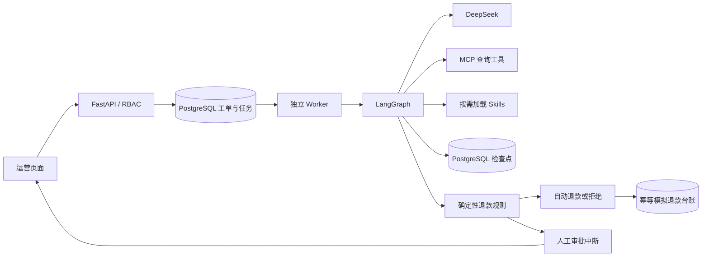

# ResolveFlow 3：可恢复的售后 Agent 工作台

项目目录：`D:\AgentProjects\ResolveFlow`。本版本包含异步执行、角色权限、运行监控、文档 RAG 和 CI。最新验收见 [VALIDATION.md](VALIDATION.md)。

## 本地使用

在项目目录的 PowerShell 运行 `./start-local.ps1`，保持终端打开，访问 http://127.0.0.1:8003/ 。该脚本启动本地 PostgreSQL（已有便携版时）、API 和独立 Worker。只运行 uvicorn 不会消费后台队列。

页面刷新后输入对应授权码，授权码存放在本机 `.env`：

|配置项|角色|允许的操作|
|---|---|---|
|APP_API_KEY|运营|查看订单/工单、提交工单|
|REVIEWER_API_KEY|审批|查看、人工审批、关闭核查工单|
|ADMIN_API_KEY|管理员|以上全部操作、失败任务重试、监控|

三个码必须不同。页面右上角可切换角色。授权码只存页面内存，后端也校验权限；隐藏按钮不是权限控制。当前是角色级共享访问码，不是个人账号、SSO 或完整用户管理。审计记录可追踪角色，尚不能区分同角色的不同个人。

## 演示路径

以运营身份提交“申请退款”，等待页面自动更新：

1. RF-1001：未使用、签收 3 天，自动模拟退款；之前已退款则显示拦截重复退款。
2. RF-1002：已使用、签收 12 天，自动拒绝退款。
3. RF-1004：已使用、签收 3 天，转人工。切换审批角色，填写理由后批准或拒绝；审批执行也在后台完成。
4. RF-1001 描述“商品已使用，申请退款”：与数据库事实冲突，转人工核查。

条件以数据库事实和检索政策为依据。事实不足、状态异常、证据缺失或显式矛盾先转人工，不能将“缺失”当作“不符合”。目前规则检查的是示例政策，不是通用的售后法律判断。所有退款均为模拟台账。

## 执行与恢复设计



- POST `/api/runs` 在同一个数据库事务中创建工单和任务，返回 **202**。浏览器每 4 秒轮询，不保持模型请求的长连接。
- Worker 用 `FOR UPDATE SKIP LOCKED` 抢占一条任务，在处理期间保持任务行锁。多个 Worker 可处理不同工单，同一条任务不能同时领取。
- Graph 检查点和退款台账独立提交；工单结果、任务完成状态和本次尝试记录在一个事务中提交。
- 进程被终止后，数据库回滚任务事务并释放锁。下一 Worker 读取同一 thread_id 的检查点，继续未完成节点。已完成的 Graph 直接同步结果，不从头调查。
- 模型/工具异常最多自动尝试 3 次，等待 2 秒、4 秒后重试；耗尽后进入 failed，由管理员手动重新入队。人工审批决定已经持久化，重试不会重新要求用户决策。
- 订单级退款唯一约束处理“台账提交后、检查点提交前”的重放窗口。任务允许至少一次执行，业务副作用保持幂等；不宣称分布式 exactly-once。
- 强制杀进程的未提交尝试不计入 attempts；attempts 统计已完成且提交的尝试。长事务只锁任务行，不跨事务持有订单锁；规模扩大后应评估数据库连接数和任务时限。
- 队列使用现有 PostgreSQL，没有额外部署 Redis/Celery。API 和 Worker 应使用相同 MODE/模型配置。

## 监控和评测

管理员在页面查看在线 Worker、任务尝试数、失败尝试数、平均/P95 耗时、失败工单数。GET `/api/metrics` 提供同样的 JSON 数据及输入/输出 token 汇总；不是 Prometheus exposition 格式。Worker 每 5 秒写心跳，超过 20 秒未更新视为离线。

结构化日志只记录工单 ID、任务类型、成功与否、异常类型和耗时。token 来自模型 usage_metadata，仅汇总已保存的调查状态，不包含未完成/异常重试的全部消耗，也不等于供应商账单。

`python evaluate_v3.py` 运行 12 条合成案例，不调用付费模型；`python evaluate_v3.py --live` 使用本地配置调用真实模型，产生费用。每条案例使用独立存储，避免评测修改运营台账。报告分别为 evaluation_v3.json / evaluation_v3_live.json。合成样本的通过率不能写成生产准确率。

## 验证与部署

```powershell
.venv\Scripts\python -m pytest test_engine.py test_mcp_skills.py test_refund_policy.py test_operations.py -q
$env:RUN_PG_TESTS='1'
.venv\Scripts\python -m pytest test_jobs.py -q
.venv\Scripts\python evaluate_v3.py
.venv\Scripts\python smoke_async.py
```

PostgreSQL 集成测试为每条测试建立随机独立 schema，结束时只删除该 schema，不删除业务数据。smoke_async.py 验证运行中的真实服务，会新增 3 条合成工单并拒绝其中的人工例外审批。

Docker 环境就绪后：

```powershell
docker compose up --build -d --wait
docker compose logs --tail=100 worker
docker compose down
```

Compose 启动 PostgreSQL、API、Worker 三个服务，数据库与运行数据使用命名卷。不要用 `down -v` 删除数据。容器数据库是独立新数据库，不会自动迁入便携 PostgreSQL 的历史记录。若本地版仍占用 8003，先停止本地版，或设置 `$env:APP_PORT='8005'` 后启动容器。

`.github/workflows/ci.yml` 包含 Python 测试、PostgreSQL 集成测试、离线评测、Docker 构建和 HTTP 冒烟验证。代码已推送私有 GitHub 仓库；远程 CI 状态以具体提交的 Actions 结果为准。工作流增加 RAG 评测和容器重建恢复验证。

本机 Docker 已完成安装并实际运行，程序在 D:/Programs/DockerDesktop，数据在 D:/DockerData。Compose 已通过保留命名卷的容器重建、表内容核对与待审批工单恢复。当前使用 demo，不调用付费模型。完整证据见 VALIDATION.md；历史 WSL 安装故障不代表当前状态。

云服务器部署还需实际 Linux 主机、域名/HTTPS、替换共享角色码、数据库备份和恢复演练。当前服务只绑定 127.0.0.1，不直接开放公网；不应把开发工作台无保护地暴露到公网。

## 简历表述

可写：基于 LangGraph 与 DeepSeek 开发售后处理 Agent，采用 MCP 只读工具和按需加载 Skills；实现 PostgreSQL 持久化检查点、异步任务队列、角色权限、人工审批及订单级退款幂等；提供运营工作台、任务监控和合成案例回归测试。

不要写：真实支付退款、生产准确率 100%、百万级并发、已上线企业生产系统、未经对应验收证明的故障恢复或远程 CI 成功。Docker 本机实跑与重建恢复已有独立报告，不能据此声称云端生产上线。

面试应能解释：为什么模型只提出建议；为什么规则作最终分流；checkpoint 与业务事务的边界；为何任务至少一次执行但退款仍幂等；进程崩溃与普通异常的重试区别；如何证明后端权限无法通过调用 API 绕过。


## 文档 RAG 与后续计划

新增受审核 Markdown 政策导入、分块、PostgreSQL 索引、BM25 检索与来源展示。首次启动种入空索引，后续修改文档需运行 `docker compose exec -T resolveflow python rag.py` 显式替换索引。详见 [RAG.md](RAG.md)、[PROJECT_HANDOFF.md](PROJECT_HANDOFF.md) 与 [ROADMAP.md](ROADMAP.md)。
