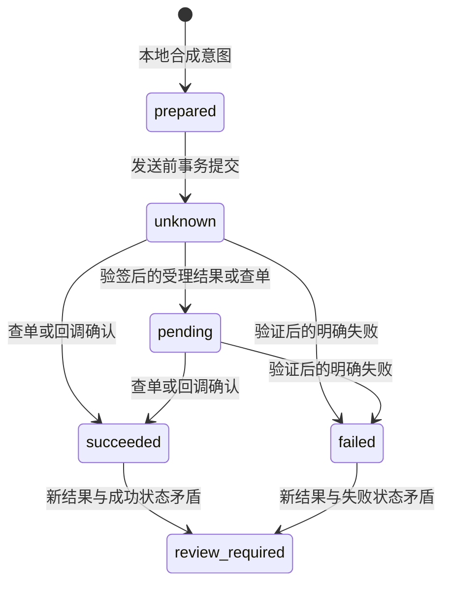

# 支付沙箱准备与本地契约演练

2026-10-05：用户确认没有支付服务商沙箱账号，授权“完成本地准备，暂缓外部沙箱验收”。5.5按此范围交付，**AC-07服务商沙箱验收仍未通过**；新增支出0元，没有真实资金、商家订单、账号申请或公网暴露。

## 已交付与暂缓项

已交付独立的`local_mock`契约实验：[实现](experiments/payment_contract.py)、[测试](test_payment_contract.py)、[演练脚本](scripts/payment_contract_qa.py)。它使用两份独立SQLite文件，分别保存请求/事件/对账记录和模拟提供方记录，没有网络客户端、支付SDK、真实密钥配置或业务数据库连接。未接入API/Worker、审批执行链或`rf_refunds`，也不进入现有Docker运行镜像。

真实服务商的支付创建、原支付与业务订单映射、退款API、验签、查单、回调入口、限流、凭据轮换、自动对账任务，以及PG迁移/权限/联合备份均待实际沙箱条件明确后实施。不能通过设置一个环境变量把本地演练切到真实支付。

|范围|本步状态|
|---|---|
|本地完整金额退款契约、幂等、回调认证模型、未知结果与对账|已验证，32项测试和15项演练|
|支付宝沙箱入口|已观察到登录要求；用户未提供账号，资格/费用/功能未核验|
|Stripe测试文档|已确认测试交易不转移资金、测试密钥要求及CLI本地事件转发方式；实际账户可用性与费用资格未核验|
|服务商沙箱退款与回调|未接入、未验收，按用户决定暂缓|
|现有业务审批、checkpoint和退款幂等|本步未改实现；本轮Docker未运行，未重跑业务/PG验收|
|正式资金|不支持|

## 运行本地演练

在项目根目录使用现有Python 3.12，无需安装支付SDK或启动Docker：

```powershell
python -m unittest test_payment_contract -v
python scripts/payment_contract_qa.py --project resolveflow-payment-my-demo --report validation/payment-my-demo.json
```

每次使用全新的项目名和报告路径。演练只写`work/resolveflow-payment-*`下的新文件和指定的新报告，拒绝覆盖已有目录/报告。包含合成金额19900分（199元），并非实际转账。输出明确带有`kind=offline_local_mock_only`、`provider_sandbox_verified=false`；`passed=true`仅指本地演练。重用目标时应换新名字，不删除已有业务数据或卷。

本步保存的演练目录为`work/resolveflow-payment-step55`，受本机私有目录权限保护且被Git忽略；两份SQLite保留用于查看演练状态。HMAC随机密钥仅在内存里，重启恢复测试在同一演练中保留该测试密钥；这些夹具不是可长期运行的支付服务或凭据恢复方案。测试套件的临时目录仅由测试自行清理。

## 本地契约

`Payment`仅接受`environment=local_mock`、`synthetic=true`、CNY整数分、合成订单/商户/支付ID。一个工作区、商户、订单对应一个完整金额退款意图，不支持分次或部分退款。金额和原支付ID一旦绑定不可修改；同订单再次创建意图会复用同一幂等键，改变字段则拒绝。

请求状态与既有`rf_refunds`分开；传入合成付款夹具不等于完成真实支付验证或获得业务审批。未来接入时必须从可信原支付记录建立映射，不能让浏览器提交金额或任意服务商交易号。既有政策/权限/人工审批及执行前事实复核必须保留。



`unknown`不等于失败。进程在发送前退出、超时、受理后丢失响应时，都禁止自动再次提交；使用原幂等键查单。查无记录可能是提供方尚未可见，仍保留未知并记录`not_found_manual_review`，不得换新幂等键重试。查单本身超时则保留原状态，调用者看到异常；本步不含自动重试调度。

`succeeded`表示最近核验到的结果，不承诺资金永久最终状态。Stripe官方测试说明包含“先成功、后失败”的退款情形，因此本地契约在新结果矛盾时进入`review_required`，同时保存最新提供方状态，不自动清除复核标记或再退款。人工解决流程和服务商撤销/冲正语义仍待适配。

本地回调用随机HMAC-SHA256密钥签署时间戳和原始字节，检查±300秒窗口、最多16KiB、严格字段/整数类型、重复JSON字段；这**不是支付宝或Stripe的实际协议实现**。事件需绑定工作区、商户、原支付ID、订单、金额、币种、退款ID；重复事件只处理一次，事件ID内容冲突拒绝，低版本不回退，同版本不同状态拒绝。退款ID不能同时映射到同一工作区/商户内的两个意图。

事件版本号是本地模拟协议提供的递增序号，不能假设任何服务商都提供此字段。真实适配需依据官方事件语义，通过查询当前退款对象处理乱序；不能直接按接收时间认定新旧。旧签名过期后需要重新签名的投递，本地窗口不是服务商重试规则。

SQLite写事务和唯一约束保护并发与事件/状态原子更新。独立子进程在持久化未知状态后使用`os._exit`退出的场景已测试；这不能外推为生产PG、任意网络故障或真实商家资金保障。

## 服务商核查与再次接续条件

[支付宝沙箱入口](https://open.alipay.com/develop/sandbox/app)本轮跳转登录页，未登录或创建账号；未取得最新可用沙箱API及费用资格证据。[Stripe测试文档](https://docs.stripe.com/testing)明确测试交易不转移资金，要求测试密钥，提供CLI本地接收Webhook方式；这说明本地开发并非必然要购买云服务器，但不证明当前用户符合账号资格或任意接入均免费。资料观察见[核查记录](validation/step-5.5-2026-10-05/provider-research.json)。

未来重新指定外部沙箱接入时，按以下门槛继续：

1. 用户自行确认可用账号、允许的地区/主体、零新增费用及测试资金标识；不在聊天中提交密码、银行卡、私钥或令牌。本轮没有要求用户现在申请。
2. 明确选择服务商及其退款/查单/事件文档版本，验证沙箱端点、签名材料、原支付证明和币种。测试凭据保存在本机私有服务文件；不得使用文档示例密钥或正式密钥。
3. 明确免费本地回调方案。只有服务商支持并且用户授权时才启用官方本地转发；任意隧道/公开端口不视为已授权。仅有出站查单不能充当入站回调验收。
4. 在新隔离环境接入实际适配器和持久化模型，保留账号权限、订单/支付映射、审批/checkpoint、幂等键和最小数据库权限。真实外部结果与旧模拟台账不可混用；外部IO不能长时间持有数据库事务。
5. 用沙箱交易完成受理后响应丢失、相同幂等键重试/查单、金额/订单/账户绑定、错误签名、重复/乱序/丢失回调、异步失败及对账。按实际服务商语义保存脱敏请求ID、退款ID、原始状态、时间和账户环境标识；供应商CLI触发的假事件也不能替代完整真实沙箱交易证据。
6. 更新备份恢复及运维手册，经对应提交CI验证后才能把AC-07改为通过。保留未完成项，不拿这次mock成功作为豁免。

当前下一项仅在收到指令后执行5.6容量、限流、隔离与安全；本地容量验收不向服务商测试环境施压。5.8统一推送/同SHA CI，4.4继续暂缓。
