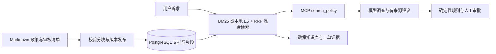

# ResolveFlow 文档 RAG

本版将原来的三条内置政策字符串，替换为可以导入、分块、持久化、检索和追溯来源的政策知识库。线上运行仍由确定性退款规则决定分流；检索结果和模型输出不能直接授权退款。

## 数据流



## 已实现

- `knowledge/*.md`：带 id/title/version 的政策原文，默认 3 份演示文档；审核来源与有效期见 knowledge/governance.json。
- 按段落切分；长段落最多 500 字符，重叠 60 字符，保留文件名、行号、版本和 SHA-256。当前内置语料生成 7 个片段。
- 中文字符 bigram 与英文词分词，去除少量常见问句词，文档标题加权的 BM25 排序，默认返回 4 个片段。
- 生产索引保存在 `rf_knowledge_documents`、`rf_knowledge_chunks`，与业务共用 PostgreSQL 命名卷。
- 第一次启动时种入文档；已有索引不会在重启时被覆盖。重新导入在单个事务中替换整个集合，移除过期片段；输入不合法则保留旧索引。
- 数据库读取使用一致快照，数据库错误向上报告，不偷偷回退到本地示例。
- MCP 返回可追溯片段；工单保存当时证据快照，前端显示文件、版本、行号和原文。后续导入不改写旧工单证据。
- 登录后可在“政策知识库”面板独立检索。`GET /api/knowledge?query=...` 需要角色授权码。
- BM25无匹配时返回空结果；混合检索可能对无关问题也返回片段，退款证据不足时仍转人工核查。

2.8已加入可选本地E5 embedding、PostgreSQL/pgvector精确cosine与BM25/RRF混合检索，本机8003已启用。默认新装为BM25，故障可降级；没有reranker。检索分数不是置信度或概率，demo执行本地embedding但不调用生成模型。实现、版本绑定、启用命令和维护边界见 [混合检索说明](SEMANTIC_IMPLEMENTATION.md)，评测结果见 [2.8报告](validation/step-2.8-2026-09-22/REPORT.md)。

## 导入政策

仅管理员/部署维护人员管理受审核Markdown文件，目前不开放任意用户上传或网页编辑。2.10起候选目录含PDF会明确拒绝，禁止静默遗漏；尚无PDF解析/OCR/页码引用，见 [格式边界](PDF_IMPORT_ASSESSMENT.md)。每个文件必须有唯一的版本化 ID：

```markdown
---
id: warranty-v1
title: 保修政策
version: '1'
---
这里写经过业务审核的政策原文。
```

将文件放入 `knowledge/`，在 `governance.json` 中填写绑定原文SHA的审核来源和有效期（缺失时不可检索/授权，详见 [治理说明](POLICY_GOVERNANCE.md)），构建镜像，再显式重新导入：

```powershell
$env:MODE='demo'
docker compose up --build -d --wait
docker compose exec -T resolveflow python policy_releases.py status
# 根据当前generation，按 POLICY_RELEASES.md 显式发布完整候选目录。
```

`rag.py --directory PATH` 可指定容器内的文档目录。该操作以目录中的全部文档替换整个政策集合，不是增量追加；请先将需要保留的文档一起放入目录。2.5起原始导入会使当前发布失效；正式使用需走 [版本发布](POLICY_RELEASES.md)。源码模式同样使用policy_releases.py并配置DATABASE_URL。

**修改退款资格必须同步审核 `refund_policy.py` 的规则及版本。** 仅修改文档不会修改程序的两项资格规则。2.3起新建议必须使用chunk_id及逐字原文quotes，原文与工单快照/镜像政策核对。文档ID或缺失依据不能授权退款；这不是自由reason的语义蕴含证明，详见 [GROUNDING.md](GROUNDING.md)。

## 评测

```powershell
python evaluate_rag.py
```

12 条标注合成查询包含 9 条相关查询和 3 条无关查询，报告 Recall@4、MRR@4、无关查询空结果比例，并在失败时返回非零退出码。报告是小样本检索验证，不能作为生产准确率或模型回答质量指标。

### 2.1：80条有来源的候选查询

新增 [候选数据](evals/rag/cases.v1.json)、[逐条复核表](evals/rag/CASES.md) 和 [标注契约](evals/rag/README.md)。覆盖退款、审批、幂等、物流、事实冲突、版本、政策缺口与无关问题；包含口语、近义表达、英文和多证据查询。固定3份政策/7个片段，记录原文、行号、版本、文档指纹及预期回答边界。版本字段不证明生效日期或业务审核状态。

全部80条均为模型生成、同一模型自查，人工待复核、未独立复核；属于候选标签，不能宣称人工金标准。55条有据可答、5条部分可答、10条政策缺口、10条无关问题。无直接答案证据不等于检索必须返回空列表，通用限制说明也不能替代所问事实。

```powershell
python scripts/validate_rag_dataset.py --report validation/rag-candidates-check.json
python -m pytest test_rag_dataset.py -q
```

校验需项目Python依赖，无需数据库/模型；报告路径须未存在。当前54项测试通过，见 [2.1报告](validation/step-2.1-2026-09-21/REPORT.md)，只证明结构、来源一致性及相关回归，不是检索质量成绩。原12条公开冒烟评测保持不变，历史 `eval_cases.json` 中refund-v1不作为本集政策来源。

2.1快照中的集合字段保持unassigned；当前集合归属以2.2的独立冻结清单为准，不重写历史标注和报告。

### 2.2：冻结集合与质量基线

[split.v1.json](evals/rag/split.v1.json) 在检索前将37个意图族分为45条调优/35条保留验收，审查34条已有公开/历史查询，相近族整组进入调优。两侧共享同一语料和模型标注，保留验收不等于外部独立或盲测；标签仍待人工复核。

```powershell
python scripts/evaluate_rag_baseline.py --report validation/rag-baseline-recheck.json
```

命令使用项目依赖，无生产数据库或模型调用；复验须使用新报告路径。[协议](evals/rag/PROTOCOL.md) 明确每项分母及上下文与直接答案的区别，[2.2结果](validation/step-2.2-2026-09-21/REPORT.md) 保存基线：保留集20条可答/部分可答问题必要证据组召回84.17%、完整证据命中75%、MRR@4为0.8917。demo调查节点对8条政策缺口建议转人工3条；引用存在19/19，但必要证据完整覆盖9/20，明确片段ID引用为0/19。

demo固定reason不是政策问答；转人工是拒答代理指标，引用覆盖只是查询证据上界，逐句引用蕴含和真实模型拒答率明确未测。69项测试通过，当前没有调优检索、改写业务或接入真实模型。保留集仅汇总，后续只看调优集逐题结果做优化；以上为2.2历史基线；2.3进度见下文，2.11再验证真实模型质量。

### 2.3：片段原文引用与保守处理

已实现 [片段引用契约](GROUNDING.md)，citations与quotes一一对应并保存来源，退款只能使用资格规则整段，部分/无依据或无效引用转人工。执行前重查快照，旧文档ID不静默升级。页面单列核对过的引用和候选原文，新模型理由未核验前不展示；最终处理说明来自规则/订单模板。

[2.3报告](validation/step-2.3-2026-09-21/REPORT.md) 记录97项基础/引用、16项PG、15项前端及5条真实API/Worker流程通过，本机8003已更新。新 [计分补充](evals/rag/SNIPPET_PROTOCOL.md) 区分文档引用和片段/摘录有效率，原80条/45对35划分未改。检索完整命中仍15/20，但保留集20条可答题全部转人工、引用覆盖0/20；demo现在限制为明确业务请求，不宣称问答质量改善。原文匹配也不代表模型断言语义正确，真实模型评测仍未进行。以上为2.3历史结果；当前2.4治理能力见下文。


### 2.4：政策审核状态与有效期

[治理说明](POLICY_GOVERNANCE.md) 定义审核状态、明确时区的生效区间、演示/维护人员审核来源、缺失信息拒绝使用和旧库升级。检索仅排名有效政策，引用检查/审批恢复读取当前状态，退款事务再次校验并与政策修改互斥；旧工单证据保留。网页查询显示当前状态，工单显示检索时与核验时状态。

三份仓库政策为demo_fixture，非人工审核，live模式不能直接采用。原文哈希和80条历史标签未改；[冻结评测补充协议](evals/rag/GOVERNANCE_PROTOCOL.md) 固定比较时间，当前指标与2.3相同。步骤[2.4验收](validation/step-2.4-2026-09-21/REPORT.md)完成，2.5发布/回滚与规则绑定已完成，见下文。


### 2.5：发布版本与规则一致性

当前索引来自完整发布快照；检索和引用携带发布ID、SHA及变更序号。API/Worker检查规则文件版本/SHA、显式代码绑定、完整动作段落和当前审核状态，发生发布/回滚后旧审批转人工；回滚不能恢复被撤销的审核。原始导入不能替代发布，重启不重置版本。政策知识库显示当前发布，工单显示检索/核验时发布身份，管理员可只读查看操作历史。

详见 [发布维护说明](POLICY_RELEASES.md)、[2.5验收](validation/step-2.5-2026-09-22/REPORT.md) 和 [冻结评测补充](evals/rag/RELEASE_PROTOCOL.md)。原文和退款规则未改变，2.5当时冻结指标与2.4相同；2.6调优见下文。


### 2.6：有限词扩展与BM25对比

在bigram BM25查询端增加人工可读的固定词表，英文按完整词边界匹配，如ledger→台账、parcel→包裹；中文包含客户→用户等有限词汇映射。词表来自调优集与现有语料，是模型整理的工程配置，非人工审核标注。原词权重1、扩展词0.5；标题仍重复2次，不改chunk或top_k=4，不改变政策授权。来源原文完整保留，返回证据记录retrieval_profile=expanded。

[调优协议](evals/rag/BM25_PROTOCOL.md)预设六候选；[调优器](scripts/tune_bm25.py)在执行检索前过滤保留问题，只用45条选择。固定方案后一次保留验收：调优完整命中36/40→40/40；保留仍15/20、必要组召回84.17%，上下文精确率27/97→27/98。demo引用覆盖和转人工比例未改善。详见 [2.6报告](validation/step-2.6-2026-09-22/REPORT.md)，不得宣称泛化或真实模型问答质量提升。

```powershell
python scripts/tune_bm25.py --report validation/bm25-tuning-recheck.json
python scripts/evaluate_rag_baseline.py --report validation/bm25-acceptance-recheck.json
python -m pytest test_bm25.py -q
```

使用项目Python依赖，报告路径不得覆盖；离线容器可关闭网络。复验会增加保留集验收次数，应记录用途，不将其逐题失败拿来调参。模型、费用与数据发送范围评估留给2.7，真实模型质量留到2.11。现有词表不能覆盖任意语言、同义词或语义歧义。


### 2.7：语义检索选型（历史方案）

已完成 [语义检索选型](SEMANTIC_RETRIEVAL.md)：2.8首选本地multilingual-e5-small，固定revision、384维、CPU编码，以PostgreSQL 17 + pgvector做精确向量排序和BM25/RRF实验。模型API预算0元，文档和查询在本机内部编码；外网仅用于公开模型/依赖下载，运行期离线能力需2.8实测。

本机可用内存有限，先限制2CPU/2GiB、并发1；当前7段无需近似向量索引。保留集至少16/20完整命中且其余质量/安全不退化、本机性能达标，才考虑默认启用；无收益保持BM25。2.7没有安装模型或声称质量提升，来源、费用、数据与当前运行核对见 [报告](validation/step-2.7-2026-09-22/REPORT.md)。

### 2.8：本地语义混合检索（已完成）

上述实验已完成，本机启用hybrid，默认新装仍BM25。保留完整命中17/20、必要组召回93.33%，核心检索p95为96.23毫秒；无关问题空检索下降，demo回答质量尚未改善。来源版本校验、降级、MCP/Worker真实业务及19表重建恢复通过，详见 [2.8报告](validation/step-2.8-2026-09-22/REPORT.md)。后续2.9评估结果见下文。

### 2.9：reranker条件评估（完成，暂缓接入）

基于45条调优缓存进行断网标签辅助理想排序诊断：完整命中仍40/40，MRR存在0.9333→1的理论空间，并集选取时上下文最多59/180→60/180，demo可答题仍39/40转人工。暂缓第二个模型，维持hybrid；没有重排模型质量/延迟实测、没有重复保留评分。理由、费用边界和重新评估条件见 [评估说明](RERANKER_ASSESSMENT.md) 及 [报告](validation/step-2.9-2026-09-22/REPORT.md)。

### 2.10：PDF条件评估与明确拒绝（完成）

当前无待导入PDF，暂缓解析/OCR/页码体系；已修复混合目录中PDF被忽略却仍成功导入的问题。大小写不敏感的PDF预检覆盖子目录，在改库前拒绝，原Markdown行号和完整发布流程保持不变。131项基础、25项PG检查通过，原19表保留。详见 [评估](PDF_IMPORT_ASSESSMENT.md) 和 [报告](validation/step-2.10-2026-09-22/REPORT.md)。

### 2.11：真实生成模型评测（完成）

80条RAG真实评测（80/80合法结构化输出）及12条合成业务执行完成；保留集有据引用覆盖16/20（80.0%），业务授权边界12/12符合预期、模拟退款0条。280次DeepSeek调用，按高峰/输入无缓存计费的保守估算3.103362元（上限10元，非账单）。原Engine/MCP和混合检索真实运行，逐条调用范围、预算及保留集规则在 [协议](LIVE_MODEL_EVALUATION.md) 中先冻结。初次检索与最终多次搜索的引用分开计分；无订单的RAG样例会触发调查流程转人工，引用匹配不等于问答准确率。演示政策仍不能授权live，主环境demo/hybrid不变。73项离线检查通过，CI无付费调用。详见 [报告](validation/step-2.11-2026-09-22/REPORT.md) 和 [复验说明](LIVE_MODEL_EVALUATION_RUNBOOK.md)。下一步2.12；人工标签/语义蕴含复核待办。

### 2.12：阶段回归与交付

[阶段报告](validation/step-2.12-2026-09-22/REPORT.md)汇总2.1–2.11的实际交付和限制。181项基础、47项PG、17项前端通过；新独立QA完成7条混合Worker流程、4种降级和19表重建/审批恢复。BM25冻结汇总与2.6一致，2.8混合检索17/20和2.11真实生成引用覆盖16/20保留各自口径，不重新付费刷分。人工标签/语义复核仍待办，演示政策不可授权live。最新独立复验入口为scripts/stage2_qa.py；阶段推送后核对同SHA CI和附件，随后进入3.1迁移框架与基线。
