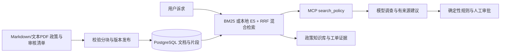

# ResolveFlow 文档 RAG

支持 Markdown／文本 PDF、物理页来源、政策发布回滚和 BM25／本地向量混合检索。Reranker 已完成实验，默认关闭；评测口径与证据见[验证成果](docs/RESULTS.md)。

本版将原来的三条内置政策字符串，替换为可以导入、分块、持久化、检索和追溯来源的政策知识库。线上运行仍由确定性退款规则决定分流；检索结果和模型输出不能直接授权退款。

## 数据流



## 已实现

- `knowledge/*.md`：带 id/title/version 的政策原文，默认 3 份演示文档；审核来源与有效期见 knowledge/governance.json。
- 按段落切分；长段落最多 500 字符，重叠 60 字符，保留文件名、行号、版本和 SHA-256。当前内置语料生成 7 个片段。
- 中文字符 bigram 与英文词分词，去除少量常见问句词，文档标题加权的 BM25 排序，默认返回 4 个片段。
- 生产索引保存在 `rf_knowledge_documents`、`rf_knowledge_chunks`，与业务共用 PostgreSQL 命名卷。
- 第一次启动时种入文档；已有索引不会在重启时被覆盖。重新导入在单个事务中替换整个集合，移除过期片段；输入不合法则保留旧索引。
- 数据库读取使用一致快照，数据库错误向上报告，不偷偷回退到本地示例。
- MCP 返回可追溯片段；工单保存当时证据快照，前端显示文件、版本、行号和原文。后续导入不改写旧工单证据。
- 登录后可在“政策知识库”面板独立检索。`GET /api/knowledge?query=...` 需要角色授权码。
- BM25无匹配时返回空结果；混合检索可能对无关问题也返回片段，退款证据不足时仍转人工核查。

可选本地 E5 embedding、PostgreSQL / pgvector 精确 cosine 与 BM25 / RRF 混合检索。新装默认 BM25，混合检索故障时可降级。检索分数用于排序；demo 可执行本地 embedding，不调用生成模型。版本绑定与配置见[混合检索说明](SEMANTIC_IMPLEMENTATION.md)。

## 导入政策

仅部署维护人员管理受审核Markdown或带sidecar的文本PDF，目前不开放任意用户上传或网页编辑。PDF解析、物理页码、失败处理与发布手册见 [PDF导入](PDF_IMPORT.md)，OCR不支持。以下为Markdown元数据格式，每个文件必须有唯一的版本化 ID：

```markdown
---
id: warranty-v1
title: 保修政策
version: '1'
---
这里写经过业务审核的政策原文。
```

将文件放入 `knowledge/`，在 `governance.json` 中填写绑定原文SHA的审核来源和有效期（缺失时不可检索/授权，详见 [治理说明](POLICY_GOVERNANCE.md)），构建镜像，再显式重新导入：

```powershell
$env:MODE='demo'
docker compose up --build -d --wait
docker compose exec -T resolveflow python policy_releases.py status
# 根据当前generation，按 POLICY_RELEASES.md 显式发布完整候选目录。
```

`rag.py --directory PATH` 可指定容器内的文档目录。该操作以目录中的全部文档替换整个政策集合，不是增量追加；请先将需要保留的文档一起放入目录。2.5起原始导入会使当前发布失效；正式使用需走 [版本发布](POLICY_RELEASES.md)。3.6起导入/发布/回滚/审核须通过migrate维护账号；源码模式使用policy_releases.py并在专用维护进程配置rf_migrator的DATABASE_URL，普通运行连接不允许改政策。

**修改退款资格必须同步审核 `refund_policy.py` 的规则及版本。** 仅修改文档不会修改程序的两项资格规则。2.3起新建议必须使用chunk_id及逐字原文quotes，原文与工单快照/镜像政策核对。文档ID或缺失依据不能授权退款；这不是自由reason的语义蕴含证明，详见 [GROUNDING.md](GROUNDING.md)。

## 评测

```powershell
python evaluate_rag.py
```

12 条标注合成查询包含 9 条相关查询和 3 条无关查询，报告 Recall@4、MRR@4、无关查询空结果比例，并在失败时返回非零退出码。报告是小样本检索验证，不能作为生产准确率或模型回答质量指标。


## 数据集与结果

评测集包含 80 条有来源查询，按 45 条调优和 35 条保留划分。混合检索在保留集 20 条可答 / 部分可答问题上的必要证据完整命中为 17/20，BM25 基线为 15/20。真实生成评测另记录有据引用覆盖 16/20，两者分别衡量检索与引用。

数据集采用模型生成及自动来源核查口径，不包含独立人工语义认证。原文匹配用于来源追踪，退款仍由订单事实、确定性规则和审批记录共同约束。

- [数据与划分](evals/rag/README.md)
- [混合检索实现](SEMANTIC_IMPLEMENTATION.md)
- [Reranker 实验](RERANKER_EXPERIMENT.md)：完成 45 题、218 对真实打分，收益未达门槛，保持关闭。
- [文本 PDF 导入](PDF_IMPORT.md)：保留物理页码、原件摘要与不可变发布快照。
- [生成评测协议](LIVE_MODEL_EVALUATION.md)与[结果](validation/step-2.11-2026-09-22/REPORT.md)
- [阶段回归](validation/step-2.12-2026-09-22/REPORT.md)与[补充验证](validation/rag-supplement-2026-09-23/REPORT.md)

复核数据契约与冻结检索指标：

```powershell
python scripts/validate_rag_dataset.py --report validation/rag-candidates-check.json
python scripts/evaluate_rag_baseline.py --report validation/bm25-acceptance-recheck.json
```

实验报告保留各次运行日期、配置与采样口径。当前工程回归和量化汇总见[验证成果](docs/RESULTS.md)。
