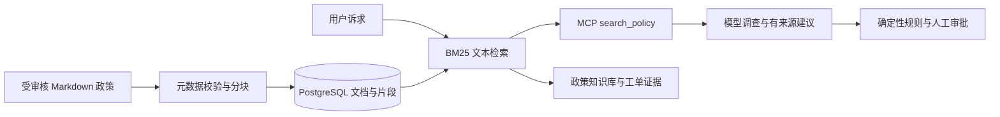

# ResolveFlow 文档 RAG

本版将原来的三条内置政策字符串，替换为可以导入、分块、持久化、检索和追溯来源的政策知识库。线上运行仍由确定性退款规则决定分流；检索结果和模型输出不能直接授权退款。

## 数据流



## 已实现

- `knowledge/*.md`：带 id/title/version 的受审核政策，默认 3 份文档。
- 按段落切分；长段落最多 500 字符，重叠 60 字符，保留文件名、行号、版本和 SHA-256。当前内置语料生成 7 个片段。
- 中文字符 bigram 与英文词分词，去除少量常见问句词，文档标题加权的 BM25 排序，默认返回 4 个片段。
- 生产索引保存在 `rf_knowledge_documents`、`rf_knowledge_chunks`，与业务共用 PostgreSQL 命名卷。
- 第一次启动时种入文档；已有索引不会在重启时被覆盖。重新导入在单个事务中替换整个集合，移除过期片段；输入不合法则保留旧索引。
- 数据库读取使用一致快照，数据库错误向上报告，不偷偷回退到本地示例。
- MCP 返回可追溯片段；工单保存当时证据快照，前端显示文件、版本、行号和原文。后续导入不改写旧工单证据。
- 登录后可在“政策知识库”面板独立检索。`GET /api/knowledge?query=...` 需要角色授权码。
- 检索无匹配时返回空结果，退款证据不足时转人工核查。

这是**文本检索 RAG**。当前没有神经网络 embedding、向量库或 reranker；BM25 分数不是置信度或概率。词汇不同但语义相同的问题可能漏检。demo 只验证检索、规则和编排，live 才会调用 DeepSeek 生成建议；本次验收没有调用付费模型。

## 导入政策

仅管理员/部署维护人员管理受审核文件，目前不开放任意用户上传或网页编辑。每个文件必须有唯一的版本化 ID：

```markdown
---
id: warranty-v1
title: 保修政策
version: '1'
---
这里写经过业务审核的政策原文。
```

将文件放入 `knowledge/`，构建镜像，再显式重新导入：

```powershell
$env:MODE='demo'
docker compose up --build -d --wait
docker compose exec -T resolveflow python rag.py
```

`rag.py --directory PATH` 可指定容器内的文档目录。该操作以目录中的全部文档替换整个政策集合，不是增量追加；请先将需要保留的文档一起放入目录。源码模式需配置 `DATABASE_URL`，运行 `python rag.py`。

**修改退款资格必须同步审核 `refund_policy.py` 的规则及版本。** 仅修改文档不会修改程序的两项资格规则。当前模型引用使用政策 ID；每条证据同时保留更细的 chunk_id，但尚未强制模型输出逐句、逐片段引用。

## 评测

```powershell
python evaluate_rag.py
```

12 条标注合成查询包含 9 条相关查询和 3 条无关查询，报告 Recall@4、MRR@4、无关查询空结果比例，并在失败时返回非零退出码。报告是小样本检索验证，不能作为生产准确率或模型回答质量指标。

### 2.1：80条有来源的候选查询

新增 [候选数据](evals/rag/cases.v1.json)、[逐条复核表](evals/rag/CASES.md) 和 [标注契约](evals/rag/README.md)。覆盖退款、审批、幂等、物流、事实冲突、版本、政策缺口与无关问题；包含口语、近义表达、英文和多证据查询。固定3份政策/7个片段，记录原文、行号、版本、文档指纹及预期回答边界。版本字段不证明生效日期或业务审核状态。

全部80条均为模型生成、同一模型自查，人工待复核、未独立复核；属于候选标签，不能宣称人工金标准。55条有据可答、5条部分可答、10条政策缺口、10条无关问题。无直接答案证据不等于检索必须返回空列表，通用限制说明也不能替代所问事实。

```powershell
python scripts/validate_rag_dataset.py --report validation/rag-candidates-check.json
python -m pytest test_rag_dataset.py -q
```

校验需项目Python依赖，无需数据库/模型；报告路径须未存在。当前54项测试通过，见 [2.1报告](validation/step-2.1-2026-09-21/REPORT.md)，只证明结构、来源一致性及相关回归，不是检索质量成绩。原12条公开冒烟评测保持不变，历史 `eval_cases.json` 中refund-v1不作为本集政策来源。

2.1快照中的集合字段保持unassigned；当前集合归属以2.2的独立冻结清单为准，不重写历史标注和报告。

### 2.2：冻结集合与质量基线

[split.v1.json](evals/rag/split.v1.json) 在检索前将37个意图族分为45条调优/35条保留验收，审查34条已有公开/历史查询，相近族整组进入调优。两侧共享同一语料和模型标注，保留验收不等于外部独立或盲测；标签仍待人工复核。

```powershell
python scripts/evaluate_rag_baseline.py --report validation/rag-baseline-recheck.json
```

命令使用项目依赖，无生产数据库或模型调用；复验须使用新报告路径。[协议](evals/rag/PROTOCOL.md) 明确每项分母及上下文与直接答案的区别，[2.2结果](validation/step-2.2-2026-09-21/REPORT.md) 保存基线：保留集20条可答/部分可答问题必要证据组召回84.17%、完整证据命中75%、MRR@4为0.8917。demo调查节点对8条政策缺口建议转人工3条；引用存在19/19，但必要证据完整覆盖9/20，明确片段ID引用为0/19。

demo固定reason不是政策问答；转人工是拒答代理指标，引用覆盖只是查询证据上界，逐句引用蕴含和真实模型拒答率明确未测。69项测试通过，当前没有调优检索、改写业务或接入真实模型。保留集仅汇总，后续只看调优集逐题结果做优化；下一步2.3实现片段引用与无依据处理，2.11再独立验证真实模型质量。
