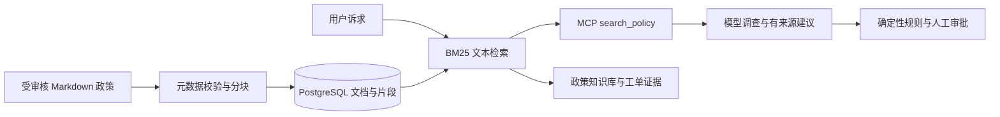

# ResolveFlow 文档 RAG

本版将原来的三条内置政策字符串，替换为可以导入、分块、持久化、检索和追溯来源的政策知识库。线上运行仍由确定性退款规则决定分流；检索结果和模型输出不能直接授权退款。

## 数据流



## 已实现

- `knowledge/*.md`：带 id/title/version 的受审核政策，默认 3 份文档。
- 按段落切分；长段落最多 500 字符，重叠 60 字符，保留文件名、行号、版本和 SHA-256。当前内置语料生成 7 个片段。
- 中文字符 bigram 与英文词分词，去除少量常见问句词，文档标题加权的 BM25 排序，默认返回 4 个片段。
- 生产索引保存在 `rf_knowledge_documents`、`rf_knowledge_chunks`，与业务共用 PostgreSQL 命名卷。
- 第一次启动时种入文档；已有索引不会在重启时被覆盖。重新导入在单个事务中替换整个集合，移除过期片段；输入不合法则保留旧索引。
- 数据库读取使用一致快照，数据库错误向上报告，不偷偷回退到本地示例。
- MCP 返回可追溯片段；工单保存当时证据快照，前端显示文件、版本、行号和原文。后续导入不改写旧工单证据。
- 登录后可在“政策知识库”面板独立检索。`GET /api/knowledge?query=...` 需要角色授权码。
- 检索无匹配时返回空结果，退款证据不足时转人工核查。

这是**文本检索 RAG**。当前没有神经网络 embedding、向量库或 reranker；BM25 分数不是置信度或概率。词汇不同但语义相同的问题可能漏检。demo 只验证检索、规则和编排，live 才会调用 DeepSeek 生成建议；本次验收没有调用付费模型。

## 导入政策

仅管理员/部署维护人员管理受审核文件，目前不开放任意用户上传或网页编辑。每个文件必须有唯一的版本化 ID：

```markdown
---
id: warranty-v1
title: 保修政策
version: '1'
---
这里写经过业务审核的政策原文。
```

将文件放入 `knowledge/`，构建镜像，再显式重新导入：

```powershell
$env:MODE='demo'
docker compose up --build -d --wait
docker compose exec -T resolveflow python rag.py
```

`rag.py --directory PATH` 可指定容器内的文档目录。该操作以目录中的全部文档替换整个政策集合，不是增量追加；请先将需要保留的文档一起放入目录。源码模式需配置 `DATABASE_URL`，运行 `python rag.py`。

**修改退款资格必须同步审核 `refund_policy.py` 的规则及版本。** 仅修改文档不会修改程序的两项资格规则。当前模型引用使用政策 ID；每条证据同时保留更细的 chunk_id，但尚未强制模型输出逐句、逐片段引用。

## 评测

```powershell
python evaluate_rag.py
```

12 条标注合成查询包含 9 条相关查询和 3 条无关查询，报告 Recall@4、MRR@4、无关查询空结果比例，并在失败时返回非零退出码。报告是小样本检索验证，不能作为生产准确率或模型回答质量指标。

下一步应先扩充近义表达、模糊诉求、版本冲突、过期政策和引用支持性的标注集。只有词法召回确实成为瓶颈时，再以同一评测集比较 embedding + 混合检索 + reranker。
