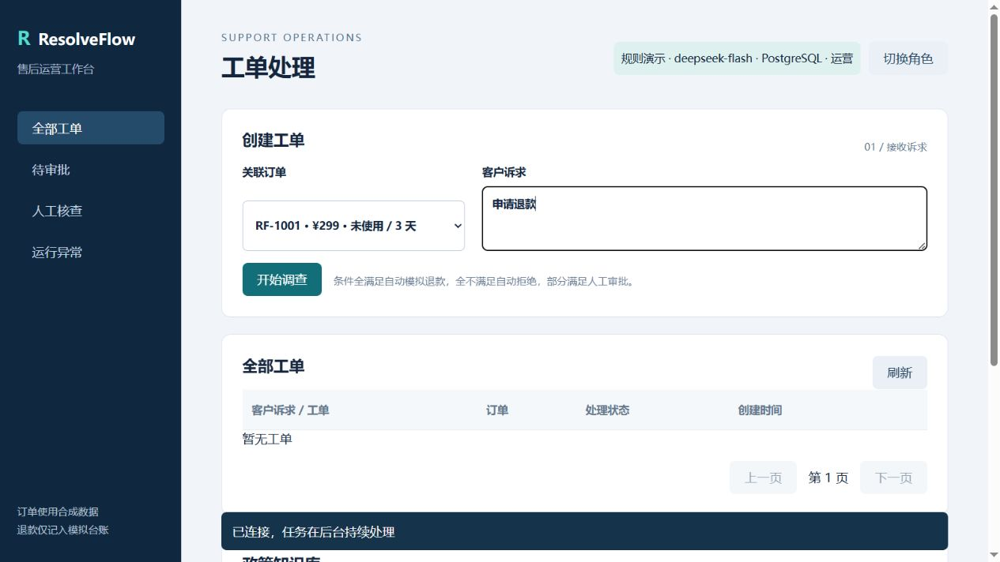
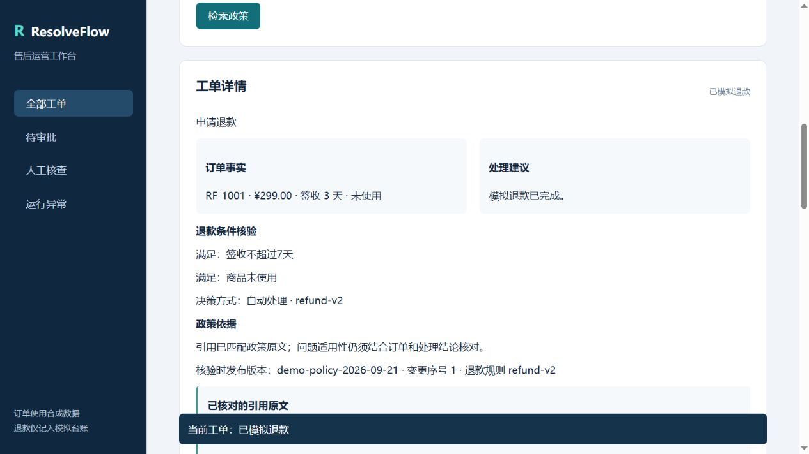
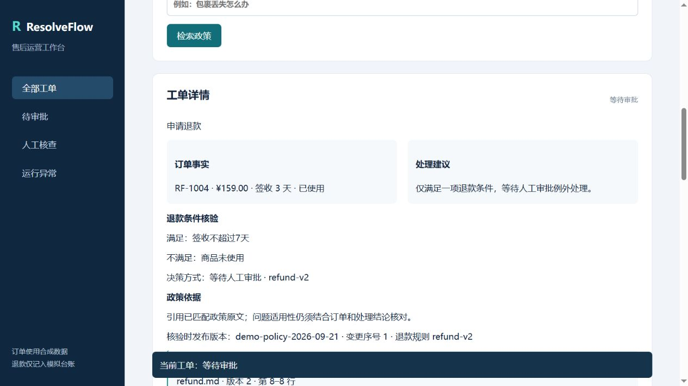
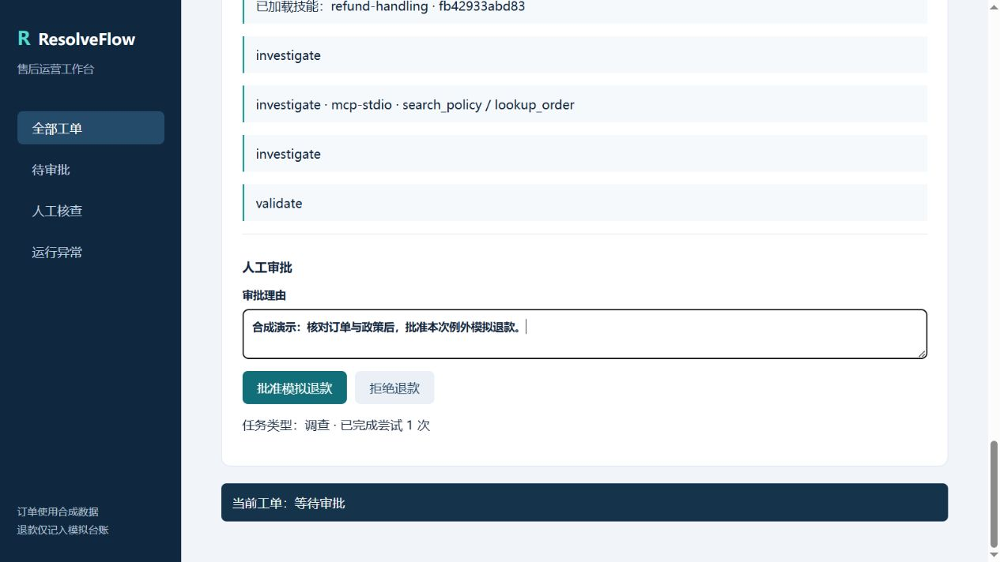
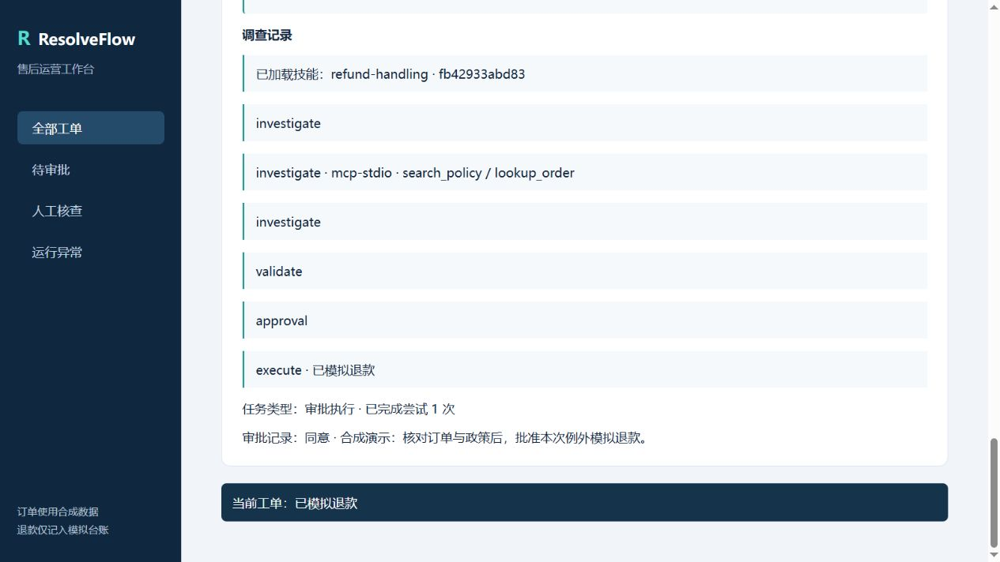
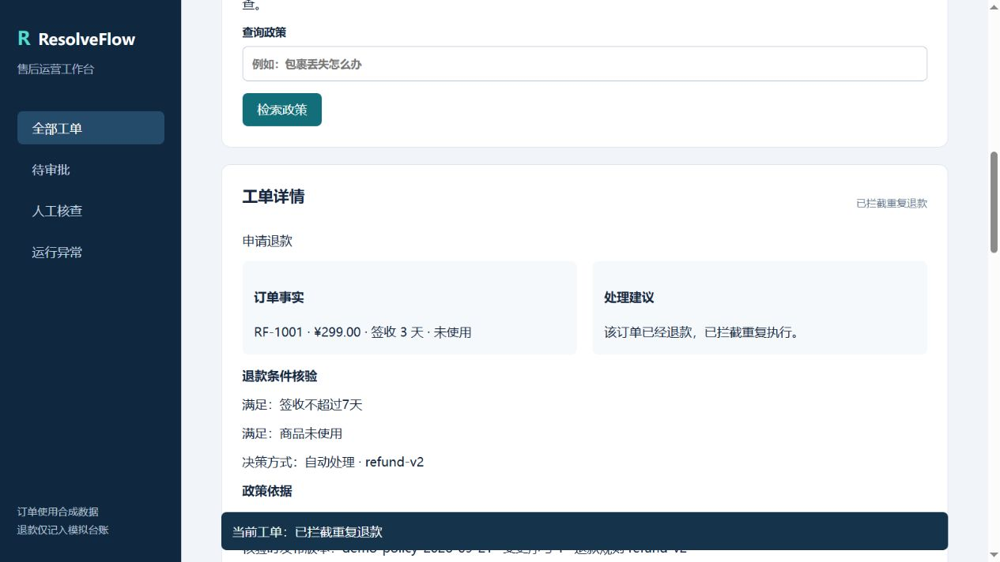
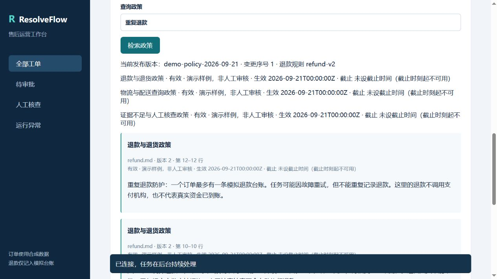
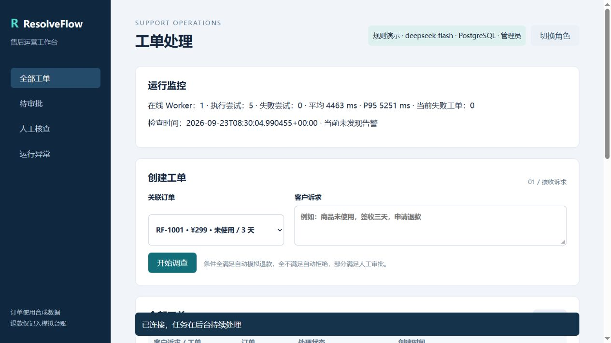
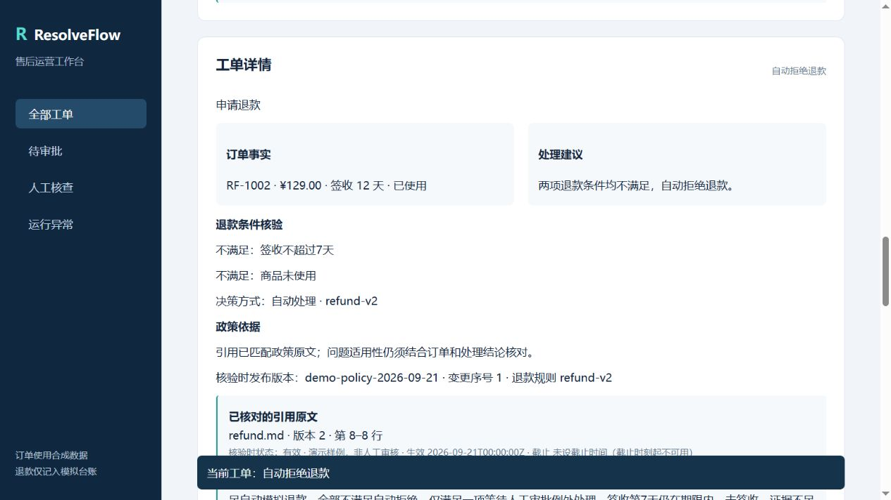

# ResolveFlow 业务流程与页面展示

[复现步骤](REPLAY.md) · [系统架构](../../ARCHITECTURE.md) · [验证成果](../RESULTS.md)

以下九张真实页面截图展示工单提交、自动处理、人工审批、原工单恢复、退款幂等和运行监控。截图采集于 2026-09-23，使用独立 demo / BM25 环境、合成订单及模拟退款，模型调用为零。当前版本另包含个人账号、双工作区和容量控制，见[文档导航](../../DELIVERY.md)。

## 场景与结果

| 订单 | 合成事实 | 处理结果 |
| --- | --- | --- |
| RF-1001 | 299 元，签收 3 天，未使用 | 首次退款；重复申请被拦截 |
| RF-1004 | 159 元，签收 3 天，已使用 | 等待人工审批；批准后原工单继续执行 |
| RF-1002 | 129 元，签收 12 天，已使用 | 规则拒绝，无退款记录 |

本轮共 4 条工单、5 次执行尝试、1 条审批和 2 条模拟退款，金额合计 458 元。审批恢复计为一次执行尝试。

## 1. 提交工单

运营选择 RF-1001 并提交退款诉求。API 保存任务，后台 Worker 处理，页面显示执行进度。

## 2. 自动处理

订单满足七天内且未使用两项条件，工单状态为 `refunded`，台账新增 29900 分。详情展示订单事实、规则版本和政策引用。

## 3. 例外审批

RF-1004 仅满足一项条件，流程进入 `awaiting_approval`。系统持久化当前状态，审批前无该订单的退款记录。

## 4. 审核决定

审批员查看调查记录、填写理由并决定批准或拒绝。决定先写入数据库，再唤醒后台流程。

## 5. 原工单恢复

批准后，同一 `run_id` 继续执行，checkpoint 从 4 条增加至 6 条，新增一条 15900 分的模拟退款。工单保留审批理由及执行记录。

## 6. 退款幂等

再次提交 RF-1001 时，新工单返回 `already_refunded`，原退款的金额、所属工单和时间保持不变。最终台账仍为两条记录。

## 7. 政策检索

搜索“重复退款”返回政策原文、文件、版本及行号。首条命中 `refund.md` 第 12 行、版本 2。此入口只检索政策，不执行订单操作。

## 8. 运行监控

管理员查看 Worker 心跳、执行尝试、失败与告警。本轮记录 1 个在线 Worker、5 次执行尝试、0 次失败，无活动告警。故障恢复通过独立注入测试验证，见[成果索引](../RESULTS.md)。

## 9. 规则拒绝

RF-1002 两项退款条件均不满足，状态为 `auto_rejected`，无该订单退款。规则拒绝属于业务结果。

## 数据与复现

[审批前记录](../../validation/step-4.2-2026-09-23/before-approval.json)、[审批后记录](../../validation/step-4.2-2026-09-23/after-approval.json)、[最终状态](../../validation/step-4.2-2026-09-23/final-demo.json)及[核对结果](../../validation/step-4.2-2026-09-23/verification.json)保留工单身份和数据库证据。

截图为原始浏览器视口，按业务阅读顺序排列；实际采集时拒绝分支早于监控，监控早于政策检索。页面使用共享角色码版本，当前账号体系见[账号说明](../../ACCOUNTS.md)。全部支付行为为模拟台账操作。
