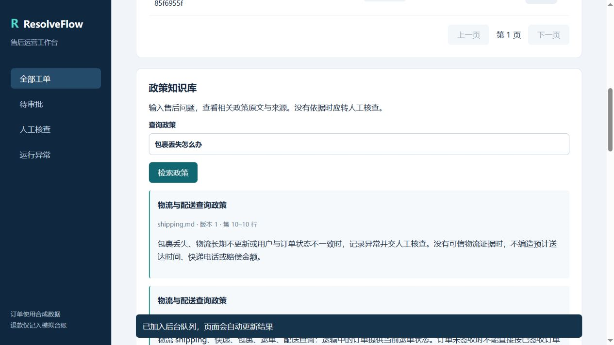

# 步骤 1.1 — 运营角色浏览器验收

> 以下为对应日期和配置的验证记录；当前版本成果见[验证汇总](../../docs/RESULTS.md)。

日期：2026-09-21。结论：**通过**。本步没有修改业务代码，没有执行审批员/管理员流程，也没有推送 GitHub。

## 环境与证据边界

- 代码基线 `cb795f8246259498b15e340014eb4bf4cd932643`。
- 用户原环境 `http://127.0.0.1:8003/` 的 Docker 引擎开始时未运行，本次启动 Docker 并恢复其 demo 三服务。
- 为验证首次退款而不删除历史台账，使用 `resolveflow-qa-step11` 独立 Compose 项目与命名卷，页面为 `http://127.0.0.1:8004/`。原项目的 `.env` 和业务记录未被本次浏览器测试修改。
- 验收服务与原API使用同一镜像 `sha256:a4f0b1774945607c0f007ae82521dcab9d6786662a803a03d9413dcd03b0b28c`，未通过修改页面或直接调用API代替用户操作。
- 所有登录、工单创建、列表查看和政策检索通过浏览器UI完成；最后只读查询测试数据库作为补充核对。
- 全程demo，所有工单的模型调用和token均为0，退款为模拟台账。

## 实际检查

|检查|实际结果|
|---|---|
|错误授权码|显示“授权码不正确”，停留在登录页|
|运营登录|显示“规则演示 · deepseek-flash · PostgreSQL · 运营”；可创建工单，无管理员监控|
|RF-1001首次退款|从排队自动更新为“已模拟退款”，两项条件满足，最终说明正确|
|否定表述|“没有使用过”未被误判为已使用|
|RF-1002自动拒绝|两项条件均不满足，显示“自动拒绝退款”|
|RF-1004转审批|显示“等待审批”，条件满足一项，运营端无批准/拒绝按钮|
|待审批筛选|列表过滤后仅包含待审批工单|
|事实冲突|RF-1001描述“商品已使用”时转人工核查，显示具体冲突|
|重复退款|第二次普通退款请求显示“已拦截重复退款”|
|政策查询|“包裹丢失怎么办”返回物流政策原文、shipping.md、版本1与来源行号|
|无关查询|“量子纠缠”显示未检索到政策并提示转人工|
|刷新与重新登录|刷新回登录页；重新登录后5条工单仍可见，点击“查看”可读原退款详情|

本次没有发现阻止步骤1.1通过的应用缺陷。一次浏览器自动化的标签定位超时，通过已观察到的控件ID定位完成；另一次整页截图捕获失败，保留了相应DOM记录，并使用成功的截图作为视觉证据。这些属于验收工具的限制，不是产品业务失败。

## 独立测试库结果

|订单|工单ID|结果|
|---|---|---|
|RF-1001|85f6955f-4e79-471c-a86b-25cbe625ba02|refunded|
|RF-1002|2cb9a7b6-5a4a-4d56-a847-ff6e4ea2ba24|auto_rejected|
|RF-1004|b0e2e4db-835b-424b-bebb-b3ad78357292|awaiting_approval|
|RF-1001|7ef0fd0a-8f08-4a9f-b6cd-adb0c3f756f8|escalated|
|RF-1001|45447c95-30e6-496b-9ad1-d0c534ac03c1|already_refunded|

数据库核对：5条工单、5个完成调查任务、1条RF-1001模拟退款、0条审批记录。任务调查完成不等于业务已经完成审批。

## 证据

- [浏览器各场景DOM记录](browser-evidence.json)
- [只读数据库与镜像核对](database-evidence.json)
- [自动退款整页截图](01-automatic-refund.png)
- [政策查询截图](03-policy-search.png)



## 重现及后续

```powershell
# 从项目目录启动已存在的独立验收环境；复用当前本机镜像，不构建镜像
.\scripts\operator-qa.ps1 -Action Start
# 查看健康状态
.\scripts\operator-qa.ps1 -Action Status
# 停止验收容器但保留工单和命名卷
.\scripts\operator-qa.ps1 -Action Stop
```

该脚本内的 `qa-step11-*` 是仅供localhost独立demo环境的公开测试夹具，不是用户真实授权码。用运营测试码登录8004；不要将这些配置用于主环境或公网服务。

本轮结束时停止独立验收容器并保留卷，原8003服务继续运行。下次开始1.2时先启动独立验收环境，再使用审批测试角色完成同意、拒绝、核查结案及重复审批。不得因1.1通过就声称完整三角色、移动端、断网或故障恢复均已验收。
